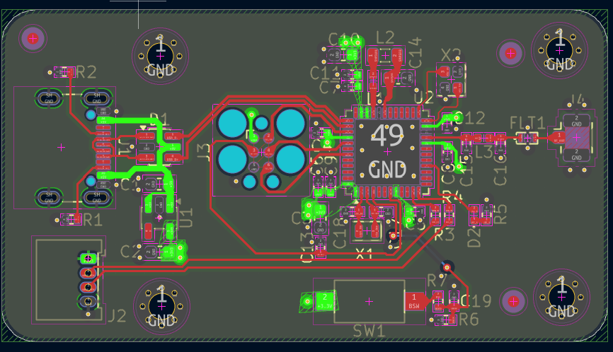
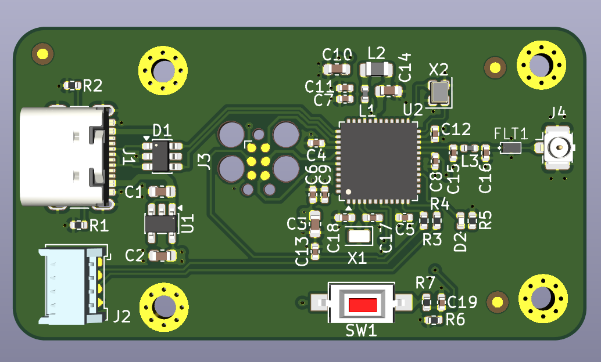
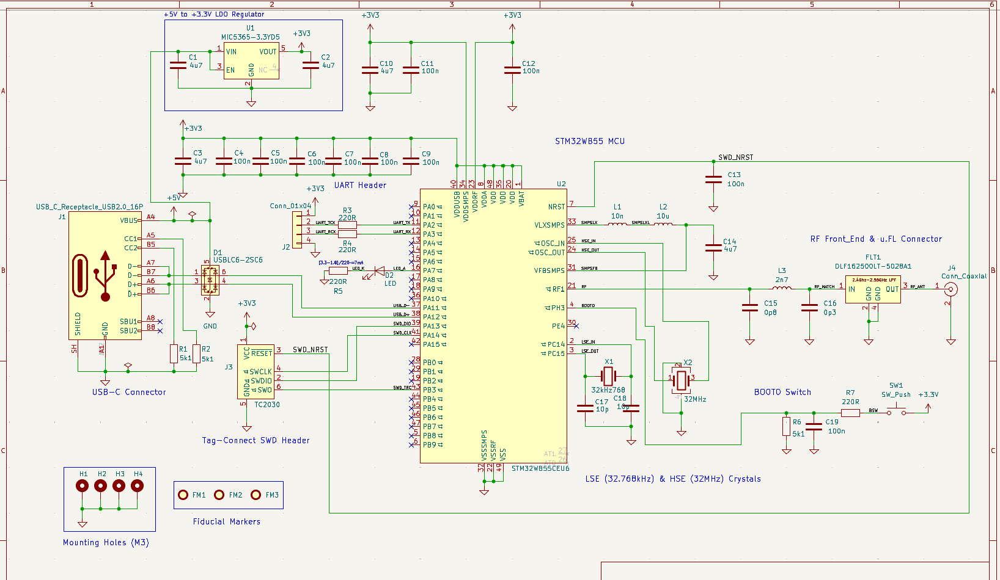

# STM32WB55 RF Development Board

## 📌 Giới thiệu

Đây là thiết kế một board phát triển sử dụng vi điều khiển **STM32WB55CEU6**, được thiết kế và layout bằng **KiCad**.

Board tích hợp các khối nguồn 3.3V, USB-C, UART, SWD, BOOT/RESET, mạch dao động và khối RF Front-End với đầu nối RF coaxial.

---

## 🧩 Thành phần chính

- **MCU:** STM32WB55CEU6
- **Nguồn vào:** USB-C 5V
- **Nguồn hệ thống:** +3.3V
- **LDO:** MIC5365-3.3YD5
- **USB:** USB Type-C
- **Debug/Programming:** SWD Header
- **UART:** UART Header
- **RF Front-End:** DLF162500LT-502BA1
- **RF Connector:** Coaxial RF Connector
- **High-Speed Crystal:** 32 MHz
- **Low-Speed Crystal:** 32.768 kHz
- **BOOT:** BOOT0 Push Button
- **RESET:** NRST
- **LED:** Status LED

---

## 🔌 Các giao tiếp

### USB-C

USB-C được sử dụng để cấp nguồn và kết nối với board.

### UART

UART Header được sử dụng để giao tiếp UART với vi điều khiển.

### SWD

SWD Header hỗ trợ:

- Nạp firmware
- Debug chương trình
- Kết nối ST-LINK

### RF

Khối RF được kết nối từ STM32WB55CEU6 đến RF Front-End và đầu nối coaxial.

---

## ⚡ Khối nguồn

Nguồn **5V từ USB-C** được đưa qua IC **MIC5365-3.3YD5** để tạo nguồn **+3.3V** cho hệ thống.

Các tụ bypass và decoupling được bố trí xung quanh MCU và các khối nguồn nhằm đảm bảo nguồn hoạt động ổn định.

---

## ⏱️ Clock

Board sử dụng hai nguồn clock:

- **32 MHz crystal:** High-Speed External Clock
- **32.768 kHz crystal:** Low-Speed External Clock

---

## 🎛️ BOOT & RESET

Board được tích hợp:

- **BOOT0 Push Button:** lựa chọn chế độ boot
- **NRST:** reset MCU

---

## 📐 PCB Design

PCB được thiết kế bằng **KiCad**.

### PCB Layout



### PCB 3D View



---

## 🖥️ Schematic

Sơ đồ nguyên lý của board:



---

## 📁 Cấu trúc thư mục

```text
STM32WB55-RF-Board/
│
├── README.md
│
├── Schematic/
│   └── STM32WB55.kicad_sch
│
├── PCB/
│   ├── STM32WB55.kicad_pcb
│   └── Gerber/
│
├── Images/
│   ├── schematic.png
│   ├── pcb_layout.png
│   └── pcb_3d.png
│
├── 3D_Models/
│   └── ...
│
└── Libraries/
    └── ...
